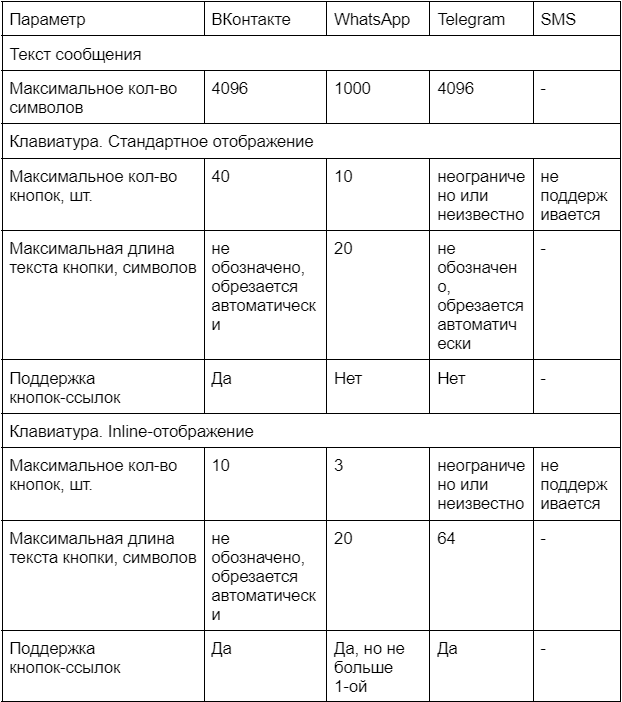
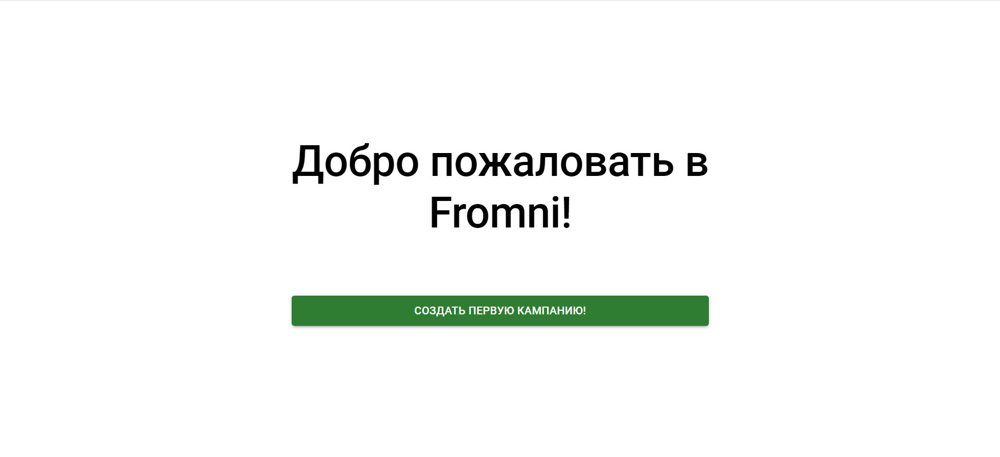
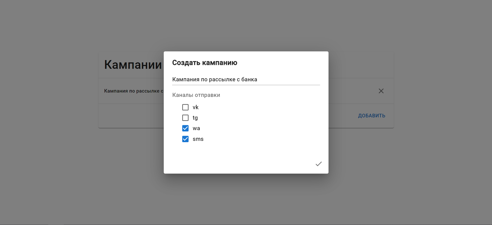
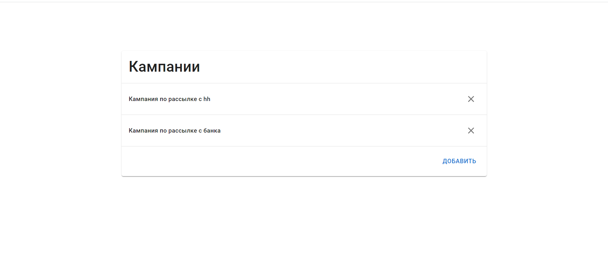
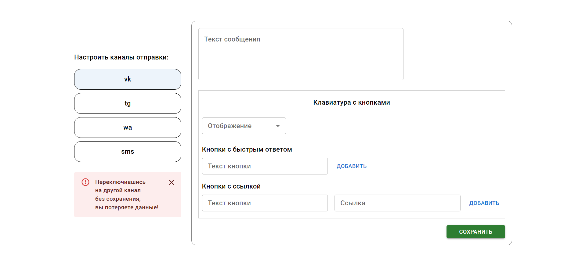
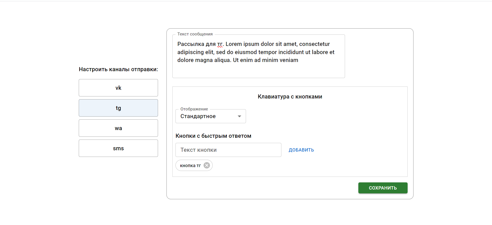
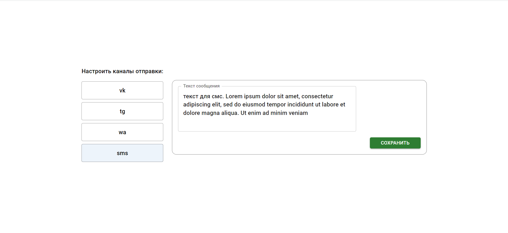
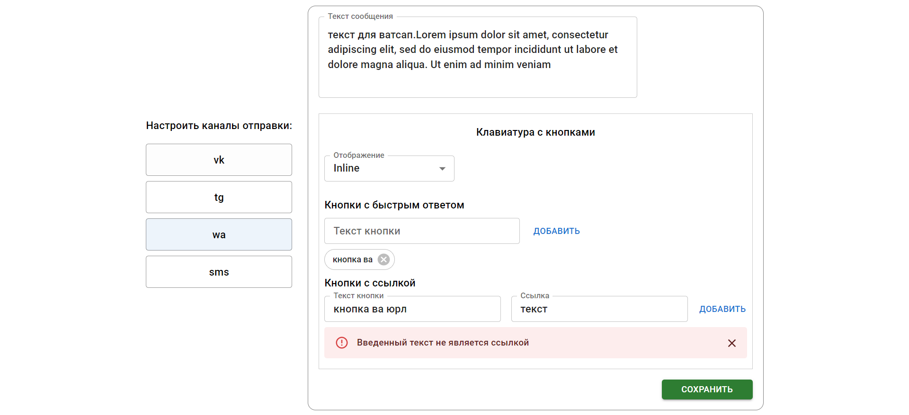
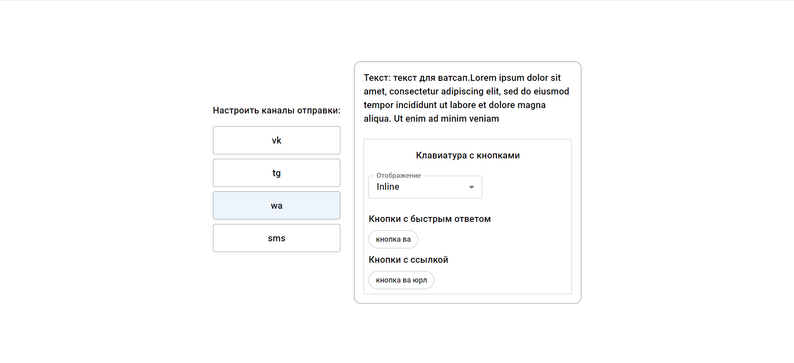

# fullstack-formni-test

Тестовое задание

---

### Техническое задание:

Приложение Fromni позволяет пользователям инициировать общение со своими клиентами, отправляя Кампании в различные мессенджеры и социальные сети. Для этого пользователю необходимо указать каналы отправки и их порядок и настроить сообщение для каждого из них. Помимо текста в некоторых каналах сообщение может содержать клавиатуру с кнопками, позволяющими выбрать один из быстрых ответов или перейти на сторонний веб-сайт.

Ориентируясь на возможности и ограничения каналов, представленные в таблице ниже, создайте форму, позволяющую:

- выбирать каналы, участвующие в Кампании (предположим, что пользователю доступны каналы ВКонтакте, Telegram, WhatsApp, SMS). Учтите, что пользователю не обязательно использовать все каналы, а их порядок может быть любым;
- настраивать сообщение для каждого выбранного канала. Для сообщения можно задать текст и клавиатуру с кнопками. В мессенджерах клавиатура может иметь стандартное отображение (показывается под полем ввода в диалоге) или inline-отображение (показывается внутри сообщения), поэтому добавьте переключатель для изменения режима отображения. Учтите, что в зависимости от типа отображения настройки клавиатуры могут отличаться. Кроме этого, кнопки клавиатуры могут быть различных типов:
  кнопки с быстрым ответом (при нажатии на них в чат отправляется сообщение от пользователя с текстом кнопки);
  кнопки с ссылкой (при нажатии на них в браузере открывается указанный URL).
  После завершения настроек у пользователя должна быть возможность сохранить их в БД по нажатию кнопки “Сохранить”.

### Используемые технологии:

- Backend:
  - Express.js
  - MongoDB
- Frontend:
  - React.js
  - Redux toolkit
  - MUI

### Функционал:

- Создание кампаний и сохранение в БД.
- Создание сообщений в каналах кампании и сохранение в БД.
- Удаление сообщений, кампаний с связанными сообщениями из БД.
- Обработка ошибок, связанных с ограничениями каналов по ТЗ, проверки на пустые и существующие данные и тд.

---

ТЗ выполнено, но само приложение сыровато(мало времени), а именно:

- не реализовано редактирование
- на странице с настройкой сообщения нельзе без сохранения переключиться на другой канал (не хранится на клиенте)(появляется предупреждение)
- оптимизация производительности и кода
- дизайн

---

### Скриншоты:

