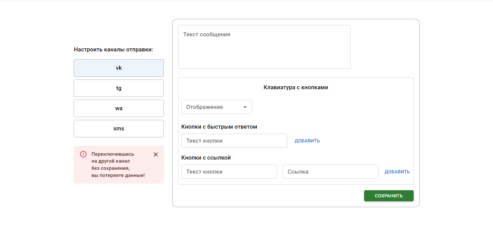

# fullstack-formni-test

Тестовое задание

---

### Используемые технологии:

- Backend:
  - Express.js
  - MongoDB
- Frontend:
  - React.js
  - Redux toolkit
  - MUI

### Функционал:

- Создание кампаний и сохранение в БД.
- Создание сообщений в каналах кампании и сохранение в БД.
- Удаление сообщений, кампаний с связанными сообщениями из БД.
- Обработка ошибок, связанных с ограничениями каналов по ТЗ, проверки на пустые и существующие данные и тд.

---

### Скриншоты:

